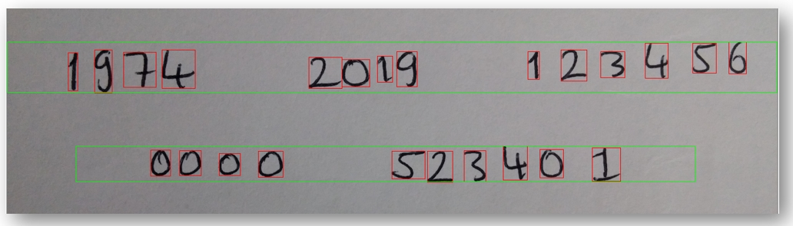
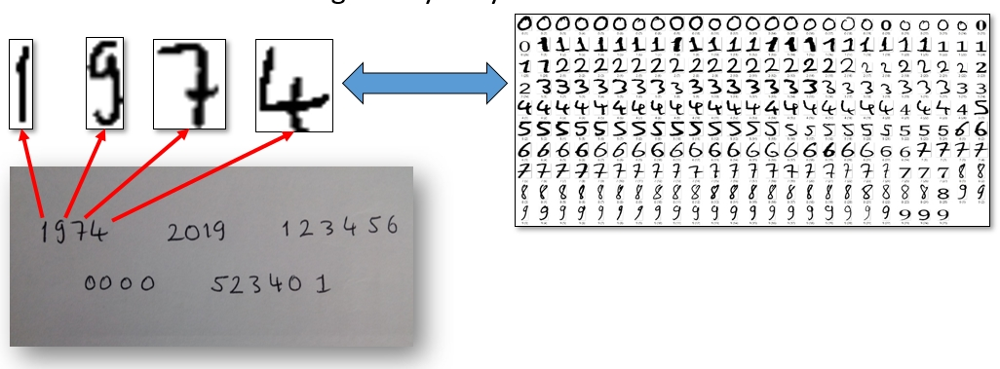

# OcrPython 

Özet:
------------------------------
O1C9R etiketli ve kayıtlı olan karakter fotoğraflarını, ocr için programa verilen fotoğraf içerisindeki her karakterle kıyaslar
ve eşleşme olduğunda kıyas anındaki karakter etiketini çıktı vererek tanımlamayı gerçekleştirir.
Kıyas aşamasındaki başarımın artması amacıyla etiketli olan fotoğraflar binary hale getirilmiştir.
Kaynak fotoğraf içindeki karakter alanıyla kıyas karakterleri hash kıyası için aynı hash boyutunda kıyaslanır.

[**Proje raporunu inceleyin**](https://github.com/recepkarademir/OcrPython/blob/master/Python%20Ocr%20Uygulama.pptx)

(Kullanılan versiyon Python 3.7.1)
____________________________________________________________________________________________________________________________________
### Fotoğraflar

____________________________________________________________________________________________________________________________________

____________________________________________________________________________________________________________________________________

____________________________________________________________________________________________________________________________________

____________________________________________________________________________________________________________________________________

____________________________________________________________________________________________________________________________________

____________________________________________________________________________________________________________________________________

İletişim
------------------------------

2015141003@cumhuriyet.edu.tr

recepkarademir0018@gmail.com

www.recepkarademir.com

https://recepkarademir.blogspot.com.tr

https://recepkarademir.wordpress.com
